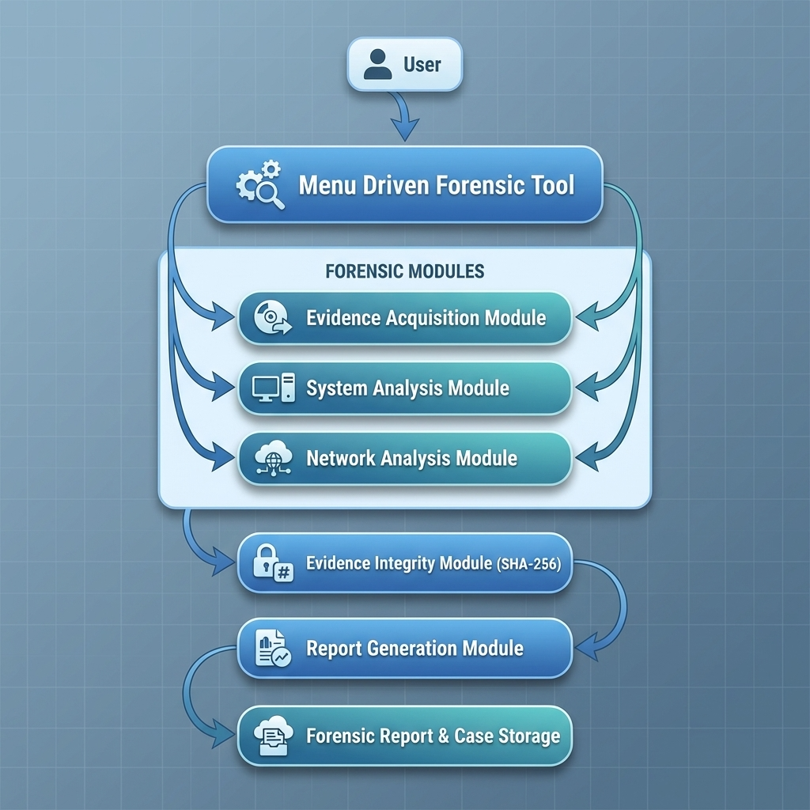

# 🔍 Digital Forensic Investigation System (DFIS)


A lightweight **Python-based Digital Forensic Investigation System (DFIS)** designed to perform **live forensic investigation**, **dump-based analysis**, **optimized evidence filtering**, **SHA-256 integrity verification**, and **automated forensic report generation** in a Kali Linux environment.

## 📖 Project Overview

Digital investigations require reliable tools for collecting and analysing evidence while preserving its integrity. This project provides a lightweight command-line based forensic framework that combines live system investigation and dump analysis within a single application.

The framework is designed to help investigators collect system information, analyse network activity, perform dump investigations, verify evidence integrity using SHA-256 hashing, and generate structured forensic reports.

Instead of extracting complete dump contents, the system implements an optimized filtering approach that stores only relevant forensic artefacts, reducing storage overhead and improving investigation efficiency.

## ✨ Features

- 🔍 Live System Forensic Investigation
- 💾 Dump-Based Memory and File Analysis
- ⚡ Optimized Filtering-Based Evidence Extraction
- 🔐 SHA-256 Evidence Integrity Verification
- 🌐 Network Connection Analysis
- 🖥️ System Information Collection
- 📊 Structured Digital Forensic Report Generation
- 📁 Organized Case-Based Evidence Storage
- 🐍 Lightweight Python CLI Application
- 🐧 Designed for Kali Linux Environment

## 🧩 Core Modules

The Digital Forensic Investigation System consists of the following modules:

### 📥 Evidence Acquisition
Collects volatile and non-volatile system information such as running processes, logged-in users, system time, USB devices, and host information.

### 🖥️ System Analysis
Analyses running services, startup programs, system uptime, open ports, and authentication logs.

### 🌐 Network Analysis
Captures active network connections, network interfaces, and communication details useful during forensic investigations.

### 💾 Dump Analysis
Performs optimized filtering on dump files to extract only relevant forensic artefacts instead of complete raw extraction.

### 🔐 Evidence Integrity
Generates SHA-256 hash values to verify evidence integrity and ensure collected data remains unchanged.

### 📄 Report Generation
Automatically creates structured forensic investigation reports and stores them within organized case folders.

## 🏗️ System Architecture

The following diagram illustrates the overall architecture of the Digital Forensic Investigation System.

<p align="center">
  
</p>

The DFIS framework follows a modular architecture where each forensic module performs a dedicated investigation task. The collected evidence is verified using SHA-256 hashing before being compiled into a structured forensic investigation report.

## 📂 Project Structure

```text
Digital-Forensic-Investigation-System/
│
├── modules/                 # Core forensic modules
│   ├── evidence_acquisition.py
│   ├── system_analysis.py
│   ├── network_analysis.py
│   ├── dump_analysis.py
│   ├── integrity.py
│   └── report_generator.py
│
├── reports/                 # Generated forensic reports
├── cases/                   # Case-based evidence storage
├── screenshots/             # README images
├── docs/                    # Documentation
├── requirements.txt
├── README.md
└── main.py
```

## 🛠️ Technologies Used

| Technology | Purpose |
|------------|---------|
| Python 3 | Core programming language |
| Kali Linux | Development and execution environment |
| Linux Commands | Live forensic evidence collection |
| SHA-256 | Evidence integrity verification |
| CLI | User interaction |
| Git & GitHub | Version control |

## ⚙️ Installation

Clone the repository:

```bash
git clone https://github.com/prachi-cyber-tank/Digital-Forensic-Investigation-System.git
```

Navigate to the project directory:

```bash
cd Digital-Forensic-Investigation-System
```

Install the required Python packages:

```bash
pip install -r requirements.txt
```

Run the application:

```bash
python3 main.py
```
